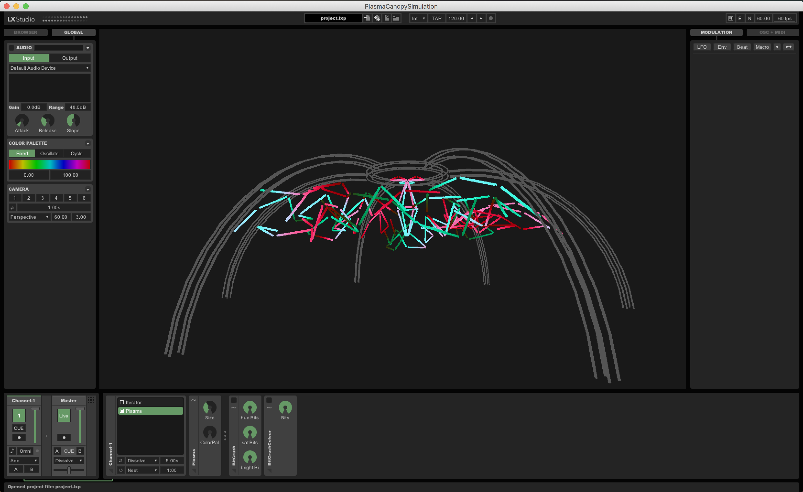

**Plasma Canopy** is a volumetric LED art piece that is due to debut at Burning Seed 2019 (on site 22/9/2019 - 02/10/2019) with [Telekinetik Chair Repair](https://telekinetik.org). Three-dimensional dynamic content synchronises to music to create an immersive space for people to enjoy shared experiences.

The lighting hardware features approximately 160 diffuse LED tubes that provide a 360 degree field of view, that are waterproofed, exposed to the elements and clearly visible from a distance.

This repository provides a fully fledged simulation instance for developers to contribute patterns and content that will be utilised at Burning Seed 2019 and recycled at future festivals and events.

It runs in Processing using [LX Studio](https://github.com/heronarts/LXStudio), an application built on the LX framework. The system may be controlled directly, or via remote OSC devices. Real-time spatial audio metering and position data can also be used to control animation. You may find the [LXStudio API](http://lx.studio/api/) of use when developing patterns; for access to the underlying source code, see the [LX Library](https://github.com/heronarts/LX).

## Installation

First, download and install [Processing 3 &rarr;](https://processing.org/download/?processing)

Make a clone of the repository in your Processing sketchbook folder.

```Shell
$ git clone https://github.com/solarleroy/PlasmaCanopySimulation.git
$ cd PlasmaCanopySimulation
$ git checkout -b <name_of_your_branch>
$ open PlasmaCanopySimulation.pde
```
### Extending

Code something awesome with using the existing patterns as a template! Feel free to reach out to Leroy for any questions and pointers at leroyck@me.com. We look forward to seeing what you come up with!

Create your own patterns in a file called `Pattern_{Your name}.pde`. In order to try your pattern out, open then `PlasmaCanopySimulation` folder in Processing, hit play and click the `BROWSER` tab on the top right. Double click patterns in here to run them.

**Note:** feature freeze will occur on 24/09/2019 for Burning Seed 2019, where final testing will occur on the production machine. To ensure that your patterns get to run at the festival, make sure to get your code in prior to that deadline.

### Build Update

On 3rd August 2019, [Telekinetik](https://telekinetik.org) crew completed fabrication of the LED fixtures. We now have approximately 160 tubes tested and ready for installation. This means that the vast bulk of the fabrication work is complete, with some minor work left with finishing up the electrical enclosures for the LED controllers.


---

**BY DOWNLOADING OR USING THE LX STUDIO SOFTWARE OR ANY PART THEREOF, YOU AGREE TO THE TERMS AND CONDITIONS OF THE [LX STUDIO SOFTWARE LICENSE AND DISTRIBUTION AGREEMENT](http://lx.studio/license).**

Please note that LX Studio is not open-source software. The license grants permission to use this software freely in non-commercial applications. Commercial use is subject to a total annual revenue limit of $25K on any and all projects associated with the software. If this licensing is obstructive to your needs or you are unclear as to whether your desired use case is compliant, contact me to discuss proprietary licensing: mark@heronarts.com
